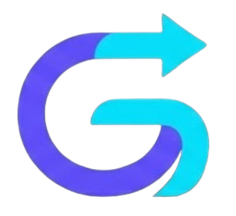
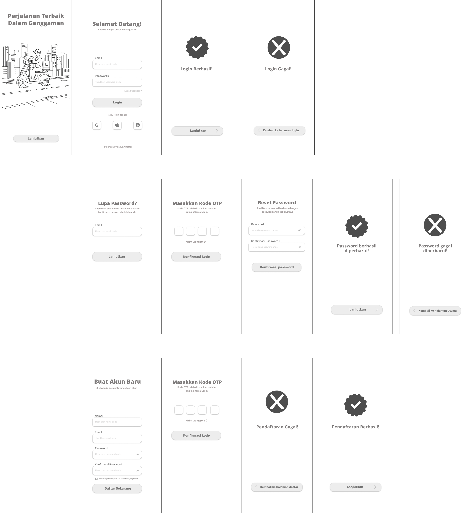
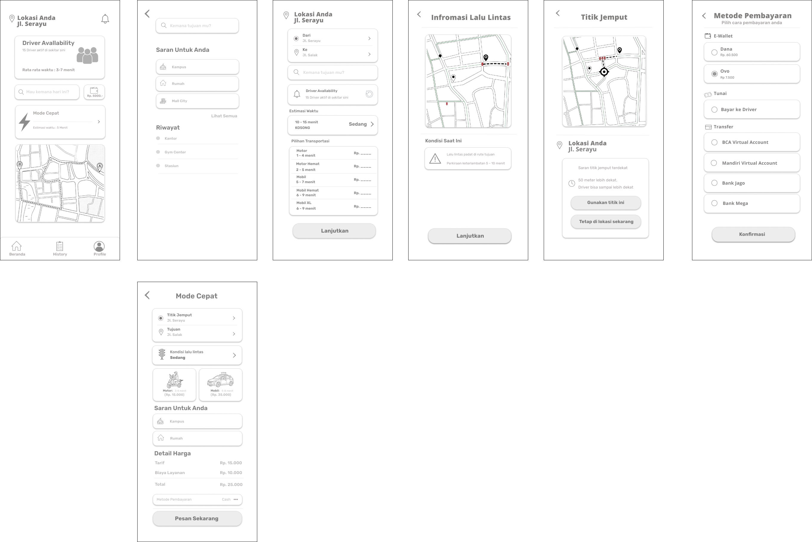
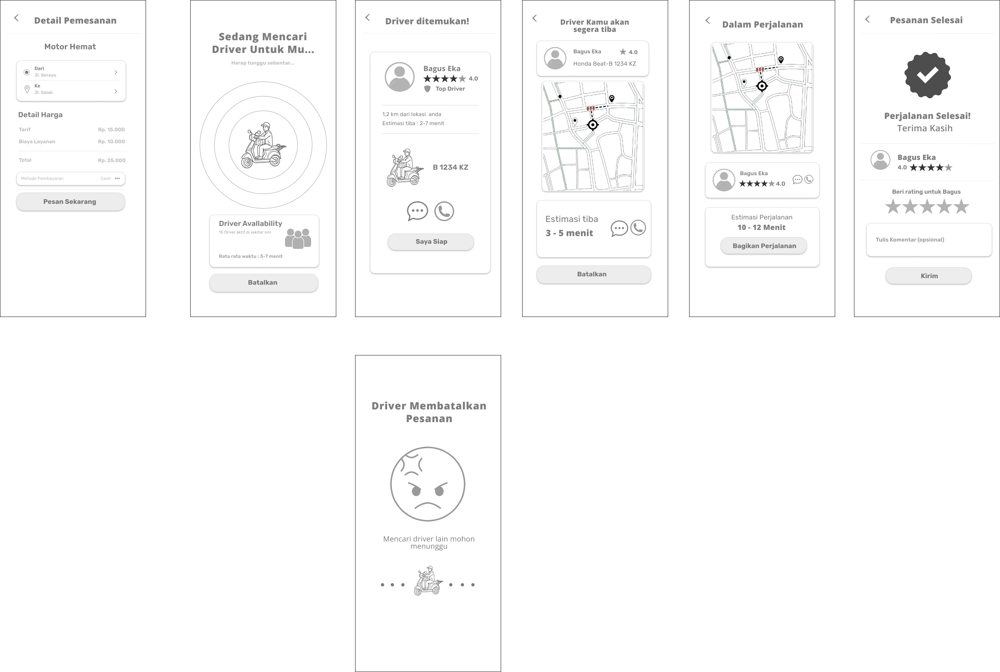
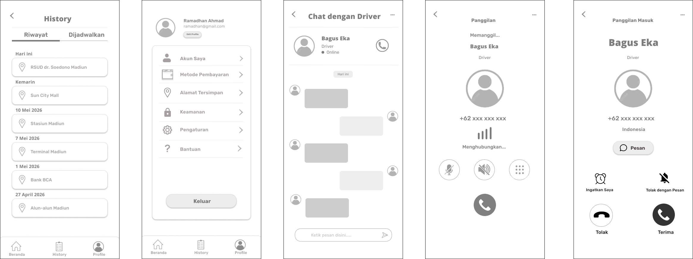
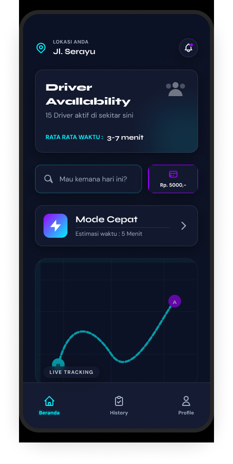
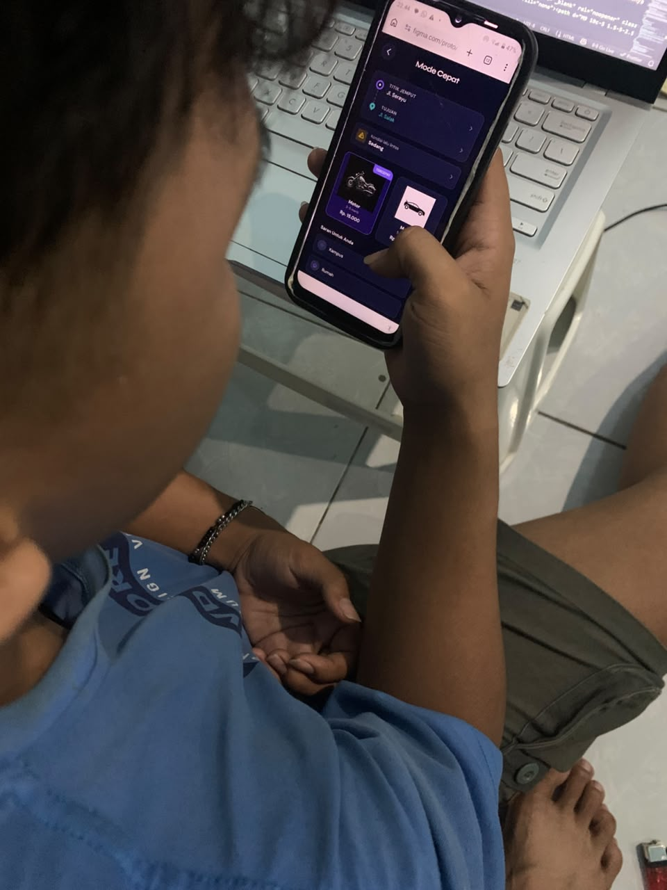
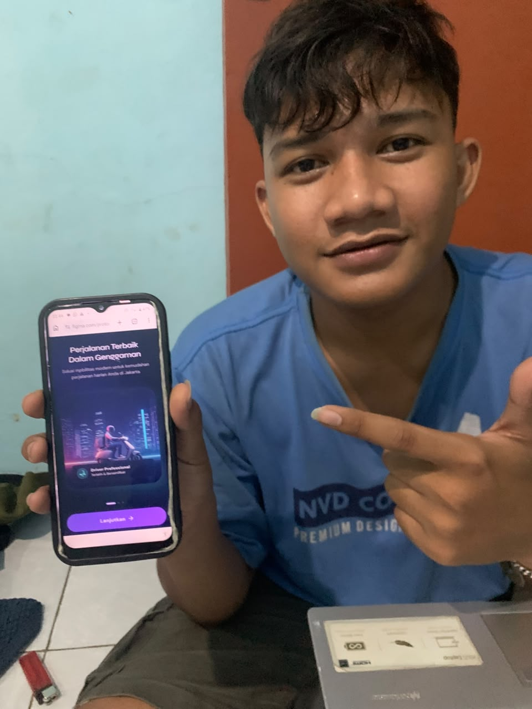
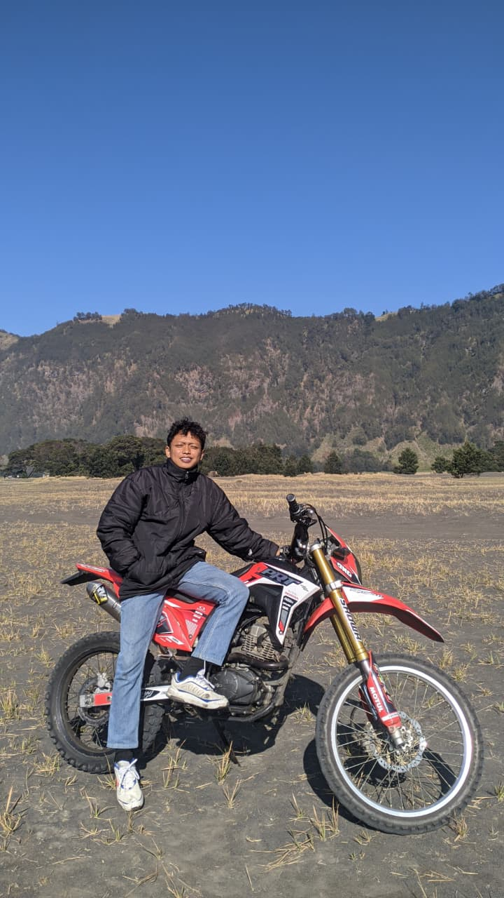

<div align="center">
  
  <h1>⚡ GOFAST</h1>
  <p><strong>Smart Transportation Platform — The Future of Urban Mobility</strong></p>

  [](index.html)
  [](https://www.figma.com/design/zeWfDdqE2L9W0G9Yodgt2X/Untitled)
  [](https://github.com/BagusDananjaya1922)
</div>

---

## 📌 Daftar Isi
- [Tentang Proyek](#-tentang-proyek)
- [Filosofi Desain & Branding](#-filosofi-desain--branding)
- [Fitur Utama](#-fitur-utama)
- [Fase Riset UX (User Research)](#-fase-riset-ux-user-research)
  - [Target User Persona](#target-user-persona)
  - [Identifikasi Masalah (Affinity Diagram & HMW)](#identifikasi-masalah-affinity-diagram--hmw)
  - [Priority Matrix (Impact vs Effort)](#priority-matrix-impact-vs-effort)
- [Proses Desain & Wireframe](#-proses-desain--wireframe)
- [Tampilan Antarmuka (UI Showcase)](#-tampilan-antarmuka-ui-showcase)
- [Usability Testing (Validasi Pengguna)](#-usability-testing-validasi-pengguna)
- [Sistem Desain (Design System)](#-sistem-desain-design-system)
- [Struktur & Implementasi Teknis](#-struktur--implementasi-teknis)
- [Cara Menjalankan Proyek](#-cara-menjalankan-proyek)
- [Profil Pengembang](#-profil-pengembang)

---

## 🚀 Tentang Proyek
**GOFAST** adalah sebuah platform transportasi digital modern yang dirancang untuk menghadirkan pengalaman perjalanan yang lebih cepat, aman, dan efisien. Di tengah hiruk-pikuk mobilitas urban perkotaan yang sering kali tidak menentu, GOFAST hadir sebagai solusi cerdas berbasis web yang memadukan sistem prediksi lalu lintas pintar dengan antarmuka pengguna kelas premium yang sangat ramah bagi semua kalangan usia.

> [!NOTE]  
> Proyek ini mencakup seluruh siklus pengembangan produk UI/UX, mulai dari tahap riset pasar (Affinity Diagram), pemetaan alur pengguna (User Flow), pembuatan desain kasar (Wireframe), pembuatan prototipe interaktif resolusi tinggi (High-Fidelity), hingga pengujian kegunaan akhir (Usability Testing).

---

## 🎨 Filosofi Desain & Branding

Identitas visual GOFAST membuang klise transportasi konvensional dan berfokus pada prinsip pergerakan yang mulus (*seamless movement*).

<div align="center">
  
</div>

### 1. Filosofi "Destination Flow"
- **Garis Tak Terputus:** Logo yang membentuk huruf **"G"** menyimbolkan perjalanan tanpa hambatan dari titik penjemputan hingga destinasi tujuan.
- **Geometri & Presisi:** Kurva geometris matematis mencerminkan *intelligent routing* dan kepastian waktu ketibaan.
- **Palet Teknologi:** Kombinasi **Deep Violet** dan **Electric Cyan** dirancang untuk membangun rasa aman, profesionalisme, serta keandalan sistem berskala premium.

---

## ⚡ Fitur Utama

| Fitur | Deskripsi | Manfaat Bagi Pengguna |
| :--- | :--- | :--- |
| ⏱️ **Smart Dynamic ETAs** | Estimasi kedatangan (ETA) yang diperbarui secara dinamis mengikuti kondisi lalu lintas waktu nyata. | Mengurangi kecemasan pengguna saat menunggu driver. |
| ⚡ **Mode Cepat (1-Tap Booking)** | Menyederhanakan proses pemesanan dengan mengingat rute rutin/favorit pengguna. | Memesan ojek dalam waktu kurang dari 3 detik dengan sekali ketuk. |
| 🗺️ **Traffic Prediction** | Deteksi dini area kemacetan sebelum perjalanan dimulai. | Membantu merekomendasikan rute alternatif terbaik. |
| 📍 **Alternative Pickup Point** | Saran titik penjemputan terdekat yang lebih mudah dijangkau oleh pengemudi. | Mengurangi waktu tunggu dan mempermudah driver menemukan penjemputan. |

---

## 🔍 Fase Riset UX (User Research)

### Target User Persona
Untuk merancang antarmuka yang ramah pengguna, dilakukan riset mendalam terhadap tiga karakteristik pengguna utama ojek daring di Indonesia.

<div align="center">
  <table>
    <tr>
      <td width="33%" align="center">
        <br>
        <strong>Aulia Raya (19 Thn)</strong><br>
        <small>Mahasiswi Aktif</small>
      </td>
      <td width="33%" align="center">
        <br>
        <strong>Handoko W. R. (55 Thn)</strong><br>
        <small>Guru Les Mewarnai</small>
      </td>
      <td width="33%" align="center">
        <br>
        <strong>Chinta Az-Zahra (15 Thn)</strong><br>
        <small>Pelajar SMP</small>
      </td>
    </tr>
  </table>
</div>

* **Aulia Raya (Kebutuhan Mobilitas Tinggi):** Membutuhkan driver cepat di jam sibuk kuliah. Pain points: Sering mendapat pembatalan driver sepihak.
* **Handoko W. Riadi (Keterbatasan Digital):** Membutuhkan antarmuka yang sangat ringkas dan berukuran besar. Pain points: Kebingungan menggunakan aplikasi yang terlalu banyak menu.
* **Chinta Az-Zahra (Keamanan & Harga):** Membutuhkan tarif yang bersahabat untuk pelajar serta fitur berbagi lokasi secara real-time demi faktor keselamatan.

### Identifikasi Masalah (Affinity Diagram & HMW)
Berdasarkan keluhan dari user persona di atas, didapatkan rumusan pertanyaan inti produk:
> **"How Might We (HMW): Bagaimana kita dapat memberikan kepastian waktu perjalanan yang akurat serta alur pemesanan yang ringkas agar semua kalangan pengguna dapat bermobilitas tanpa kendala?"**

### Priority Matrix (Impact vs Effort)
Untuk efisiensi pengerjaan, seluruh ide fitur dipetakan ke dalam matriks prioritas:

* **High Impact · Low Effort (Prioritas Utama):**
  * Indikator ketersediaan armada aktif di sekitar pengguna.
  * Estimasi waktu berbasis rentang waktu (misalnya: 10 - 15 menit).
  * Pembaruan kalkulasi ETA dinamis.
* **High Impact · High Effort (Rencana Lanjutan):**
  * Sistem alokasi otomatis jika driver membatalkan orderan secara tiba-tiba.
  * Fitur *Auto-Suggestion* rute berdasarkan histori aktivitas harian pengguna.

---

## ✏️ Proses Desain & Wireframe

Sebelum menuju ke tahap pembuatan UI akhir, struktur dasar disusun menggunakan desain kasar (sketsa) dan Wireframe (Lo-Fi) untuk merancang tata letak navigasi satu tangan (*one-hand placement design*).

<div align="center">
  <p><strong>Beberapa Lembar Kerja Wireframe Rendah (Lo-Fi) Proyek GOFAST:</strong></p>
  <table>
    <tr>
      <td></td>
      <td></td>
    </tr>
    <tr>
      <td></td>
      <td></td>
    </tr>
  </table>
</div>

---

## 📱 Tampilan Antarmuka (UI Showcase)

Proyek ini telah direalisasikan menjadi antarmuka tingkat tinggi (Hi-Fi) premium dengan konsep *Glassmorphism* dan visual *dark mode* yang berkelas.

<div align="center">
  <p><strong>Alur Layar Interaktif Utama Aplikasi GOFAST:</strong></p>
  <table>
    <tr>
      <td align="center"><br><small>Tampilan Awal</small></td>
      <td align="center"><br><small>Beranda Utama</small></td>
      <td align="center"><br><small>Mode Cepat</small></td>
      <td align="center"><br><small>Detail Pesanan</small></td>
      <td align="center"><br><small>Lalu Lintas</small></td>
    </tr>
    <tr>
      <td align="center"><br><small>Layanan Biasa</small></td>
      <td align="center"><br><small>Mencari Driver</small></td>
      <td align="center"><br><small>Pembayaran</small></td>
      <td align="center"><br><small>Riwayat</small></td>
      <td align="center"><br><small>Profil</small></td>
    </tr>
  </table>
</div>

> [!TIP]  
> Desain di atas dapat dicoba langsung secara interaktif melalui prototipe Figma. Buka tautan berikut untuk berinteraksi: [⚡ Cobalah Figma Live Prototype](https://www.figma.com/proto/zeWfDdqE2L9W0G9Yodgt2X/Untitled?node-id=0-1)

---

## 👥 Usability Testing (Validasi Pengguna)

Untuk membuktikan tingkat efisiensi desain baru, dilakukan pengujian kegunaan langsung menggunakan metode *Task-based testing* pada target responden.

<div align="center">
  <table>
    <tr>
      <td></td>
      <td></td>
    </tr>
  </table>
</div>

### Hasil Evaluasi UT
* **Responden:** Naufal Gavin Annafi (Mahasiswa).
* **Feedback:** 
  > *"Tampilan antarmukanya berasa sangat modern, bersih, dan premium. Sebagai mahasiswa yang sering terburu-buru, hadirnya **Mode Cepat** sangat membantu karena memotong banyak aksi pemesanan dan menghemat waktu secara signifikan."*
* **Rekomendasi Lanjutan:** Diperlukan optimasi kontras visual pada teks penjelasan rute saat berada di bawah terik matahari (keadaan outdoor).

---

## 🔠 Sistem Desain (Design System)

### 1. Tipografi & Skala Teks
* **Display & Heading:** `Syne` (Geometris, tangguh, dan sangat berkarakter modern).
* **Body Text & Copy:** `DM Sans` (Tingkat keterbacaan yang sangat tinggi pada ukuran layar yang kecil).

### 2. Kode Variabel Warna (Design Tokens)
```css
:root {
  --primary-violet: #6C63FF; /* Warna brand utama */
  --soft-purple:    #8B5CF6; /* Gradasi pendukung */
  --accent-cyan:    #14B8A6; /* Warna aksen/konfirmasi */
  --dark-card:      #12182B; /* Background kartu */
  --dark-bg:        #060816; /* Latar belakang utama */
}
```

---

## 🛠️ Struktur & Implementasi Teknis

Repository ini disusun dengan arsitektur web statis yang cepat, bersih, dan teroptimasi:

```bash
├── css/
│   ├── style.css         # Stylesheet utama (layout, variabel warna, grid, sistem kartu)
│   └── animation.css     # Animasi transisi, scroll-reveal, progress fills, dan efek glassmorphism
├── js/
│   └── app.js            # Logika menu responsif, scroll effect header, dynamic ETA simulation, dan scroll reveal
├── image/
│   └── [Aset gambar .WebP proyek GOFAST]
├── index.html            # File HTML utama (struktur layout web landing page)
└── README.md             # Dokumentasi proyek
```

---

## 💻 Cara Menjalankan Proyek

Proyek ini tidak memerlukan instalasi backend yang rumit. Anda dapat membukanya langsung di peramban (browser) Anda:

1. **Unduh (Clone) Repository:**
   ```bash
   git clone https://github.com/BagusDananjaya1922/GOFAST.git
   ```
2. **Masuk ke Direktori Proyek:**
   ```bash
   cd GOFAST
   ```
3. **Jalankan Aplikasi:**
   * Buka file `index.html` langsung dengan klik dua kali di komputer Anda.
   * Atau gunakan extension **Live Server** di VS Code untuk pengalaman pengembangan yang lebih nyaman secara lokal.

---

## 👨‍💻 Profil Pengembang

<div align="center">
  
  <h3>Bagus Dananjaya</h3>
  <p><strong>UI/UX Designer & Frontend Developer</strong></p>
  
  <p>
    NIM: <strong>253307045</strong><br>
    Program Studi: <strong>Teknologi Informasi</strong><br>
    Institusi: <strong>Politeknik Negeri Madiun</strong>
  </p>

  <p>
    <a href="https://github.com/BagusDananjaya1922" target="_blank">
      
    </a>
    &nbsp;
    <a href="https://instagram.com/b.guss22" target="_blank">
      
    </a>
    &nbsp;
    <a href="https://wa.me/6285856910642" target="_blank">
      
    </a>
  </p>
</div>
